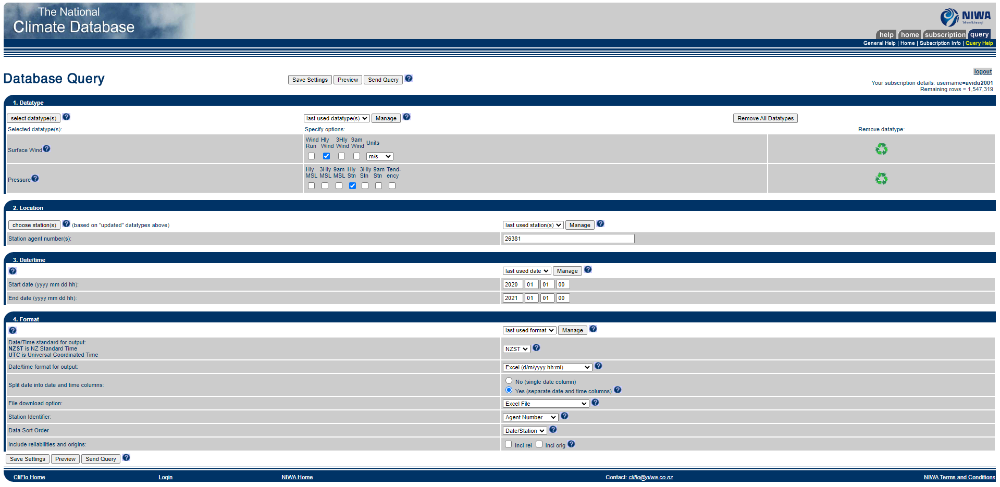

# Transfer Learning for Air Quality Inference

This repository contains code and resources for the "Transfer Learning for Air Quality Inference" project. The project is divided into two main sections: **Town Ranking Algo** and **Demo Day**. The data we use is for four New Zealand Towns: Cromwell, Invercargill, Masterton and Reefton

## Town Ranking Algorithm

The Town Ranking Algo folder includes components related to the algorithm for ranking towns based on air quality. This section comprises four main parts:

### Metadata

The metadata folder contains all the data necessary for the algorithm. The data is provided in CSV format and includes the following information:
- Wind and pressure data over the year 2020
- Discrete values of population, area, altitude, and woodburner count for each town

### Scripts

The scripts folder contains two key scripts for the algorithm:

1. `runAlgo.py`: This script is used to run our algorithm, which calculates town rankings based on the data defined in our paper. Additionally, it can incorporate data for an extra town (e.g., Wellington) if provided in the same format as the original metadata files.

2. `processClifloData.py`: This script is designed to clean the output from Cliflo, ensuring that the resulting file contains data from only one station and includes only pressure and wind data in 2 seperate files.  `{townname}Unprocessed.csv` is the renamed and converted file from the Clifo download output.

### backend

The backend folder houses the server for our Demo Day application. This server interacts with the front-end app and handles data requests and responses.

## Demo Day

The Demo Day section is dedicated to the front-end application of our project, developed using React. This folder contains all the necessary code and resources for the user interface and interaction with the town ranking algorithm.

---

## Data Collection and Processing

### Cliflo Data
Wind Speed and Pressure is collected from Cliflo database provided by NIWA this data is in the unprocessed data folder using Cromwell as an example. For each metadata feature a single file will be downloaded included both Wind and Atmospheric Pressure data. This will be processed through processClifoData.py script.

The data was collected with the settings as seen below, the station number will change for each town as they are inidividually downloaded.

### Discrete data
This is Alitude, Population Density, and Wood Burner Density data in the format of Population, Altitude, Wood Burner and Area. Altitude is collected from https://en-nz.topographic-map.com. Stats NZ was used to collect the population and wood burner data from https://www.stats.govt.nz/information-releases/statistical-area-1-dataset-for-2018-census-updated-march-2020#regional. Stats NZ GIS software was used to gather the data for area https://datafinder.stats.govt.nz/data/?geotag=global%2Foceania%2Fnew-zealand. These values are inputted in one file for each town in {town name}_discrete_metadata.csv.

### Algorithm code and modularity

Our code is modular therefore towns can be added dynamically given it is preprocessed as mentioned above. For adding metadata features 
